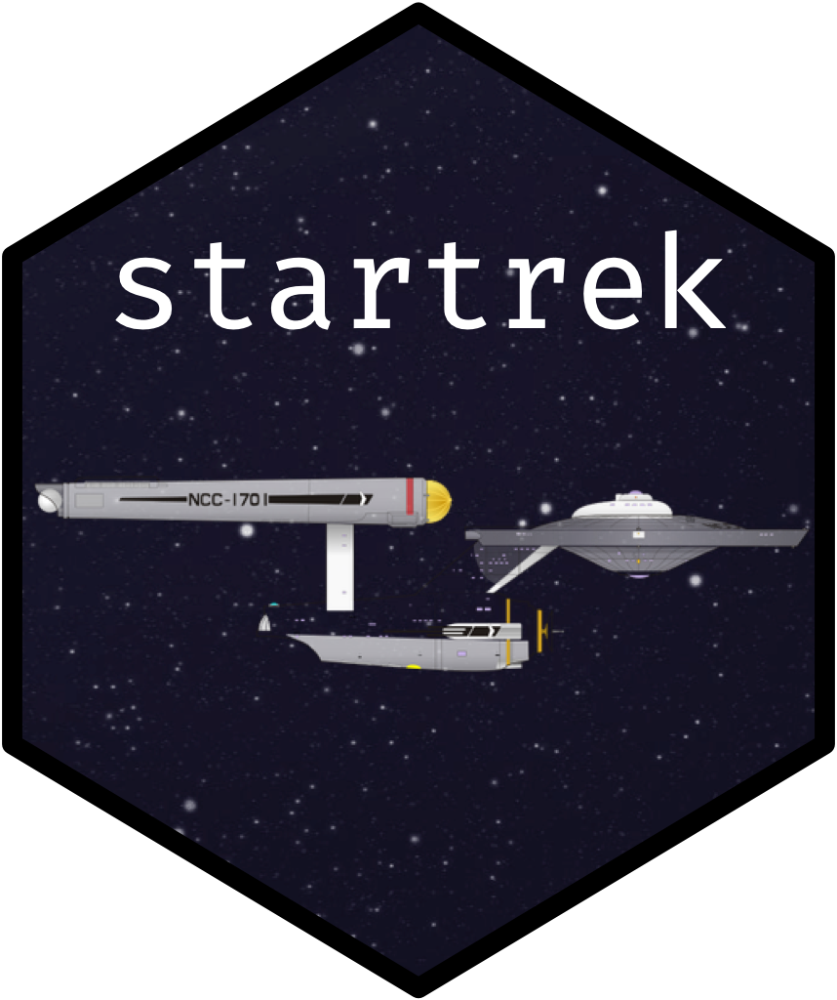
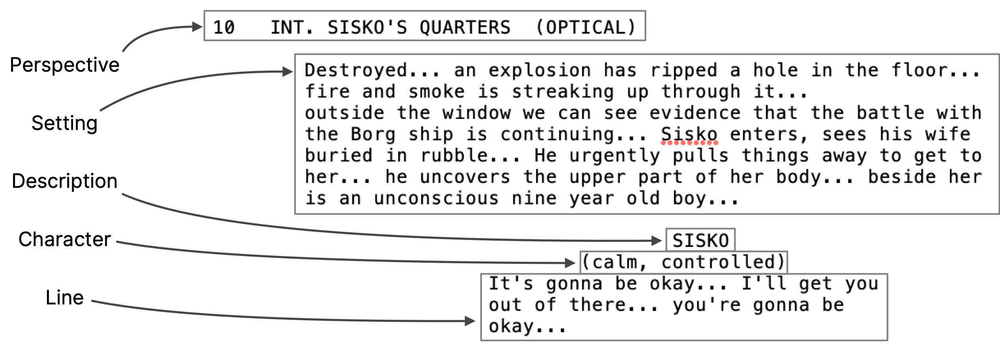

<!-- README.md is generated from README.Rmd. Please edit that file -->

# startrek 

<!-- badges: start -->

[](https://travis-ci.org/tyluRp/startrek)
[](https://ci.appveyor.com/project/tyluRp/startrek)
<!-- badges: end -->

The goal of startrek is to access Star Trek transcripts in a
[`data.frame`](https://stat.ethz.ch/R-manual/R-devel/library/base/html/data.frame.html)
for easy analysis. All transcripts have been parsed from text files to a
[tidy data](http://vita.had.co.nz/papers/tidy-data.html) format.

## Installation

Keep in mind that this is a data package which stores the data locally.
There aren’t any functions which scrape data from a reliable source. As
of now, the size of this package is ~17.57 MB.

If the size isn’t a concern, you can install the development version
from GitHub:

``` r
devtools::install_github("tylurp/startrek")
```

Or, download the data to disk from the data folder in this repository.

## Example

To access an episode transcript from The Next Generation series, see the
`tng` list:

``` r
library(startrek)
library(tibble)
library(dplyr)

tng$`The Inner Light`
#> # A tibble: 410 x 6
#>       id perspective    setting         character  description line        
#>    <int> <chr>          <chr>           <chr>      <chr>       <chr>       
#>  1    83 3 EXT. SPACE … at warp.        PICARD (V… <NA>        Captain's l…
#>  2    94 4 INT. BRIDGE  PICARD, RIKER,… PICARD     <NA>        The last ti…
#>  3    99 4 INT. BRIDGE  PICARD, RIKER,… GEORDI     <NA>        Nine hours.…
#>  4   101 4 INT. BRIDGE  PICARD, RIKER,… PICARD     <NA>        "The entire…
#>  5   104 4 INT. BRIDGE  PICARD, RIKER,… RIKER      <NA>        That's a li…
#>  6   107 4 INT. BRIDGE  PICARD, RIKER,… PICARD     <NA>        And for me.…
#>  7   115 4 CONTINUED:   PICARD, RIKER,… WORF       <NA>        Sir, sensor…
#>  8   120 4 CONTINUED:   PICARD, RIKER,… PICARD     <NA>        On screen.  
#>  9   126 5 ANGLE - VIE… An alien objec… PICARD     <NA>        Magnify.    
#> 10   130 5 ANGLE - VIE… The object spr… PICARD     <NA>        Mister Data?
#> # … with 400 more rows
```

Or access the entire series and play with the data in creative ways. For
example, we might infer character specific episodes by counting the
number of lines each character has in each episode:

``` r
tng %>% 
  bind_rows(.id = "episode") %>% 
  select(episode, everything()) %>% 
  group_by(episode) %>% 
  count(character, sort = TRUE)
#> # A tibble: 4,227 x 3
#> # Groups:   episode [176]
#>    episode               character     n
#>    <chr>                 <chr>     <int>
#>  1 All Good Things...    PICARD      348
#>  2 Encounter at Farpoint PICARD      224
#>  3 Interface             GEORDI      197
#>  4 Future Imperfect      RIKER       183
#>  5 Frame of Mind         RIKER       177
#>  6 The Outcast           RIKER       173
#>  7 Suspicions            BEVERLY     172
#>  8 Captain's Holiday     PICARD      171
#>  9 Bloodlines            PICARD      168
#> 10 Remember Me           BEVERLY     165
#> # … with 4,217 more rows
```

The Deep Space Nine series is also available:

``` r
ds9$Chimera
#> # A tibble: 415 x 6
#>       id perspective  setting          character description   line        
#>    <int> <chr>        <chr>            <chr>     <chr>         <chr>       
#>  1    79 2 INT. RUNA… ODO is in the c… O'BRIEN   (moving to t… How long wa…
#>  2    81 2 INT. RUNA… ODO is in the c… ODO       <NA>          Almost two …
#>  3    86 2 INT. RUNA… O'Brien's surpr… O'BRIEN   (noticing)    You dropped…
#>  4    90 2 INT. RUNA… O'Brien's surpr… ODO       (nods)        We entered …
#>  5    94 2 INT. RUNA… O'Brien's surpr… O'BRIEN   (taking a se… What's that?
#>  6    96 2 INT. RUNA… O'Brien's surpr… ODO       <NA>          The shopkee…
#>  7    99 2 INT. RUNA… O'Brien's surpr… O'BRIEN   <NA>          I didn't kn…
#>  8   104 2 CONTINUED: O'Brien's surpr… ODO       <NA>          It's a pres…
#>  9   108 2 CONTINUED: O'Brien's featu… ODO       (misundersta… You don't t…
#> 10   110 2 CONTINUED: O'Brien's featu… O'BRIEN   <NA>          I'm sure sh…
#> # … with 405 more rows
```

The columns have been arranged in a specific order to read from left to
right or when using `glimpse()`, top to bottom. For example:

``` r
ds9$Chimera %>% 
  .[5, ] %>% 
  glimpse()
#> Observations: 1
#> Variables: 6
#> $ id          <int> 94
#> $ perspective <chr> "2 INT. RUNABOUT"
#> $ setting     <chr> "O'Brien's surprised to hear he was asleep that long…
#> $ character   <chr> "O'BRIEN"
#> $ description <chr> "(taking a seat)"
#> $ line        <chr> "What's that?"
```

The raw text files were parsed using the scripts found in the data-raw
folder of this repository. Below is a visual explanation:

``` r
ds9$Emissary %>% 
  .[26, ] %>% 
  glimpse()
#> Observations: 1
#> Variables: 6
#> $ id          <int> 289
#> $ perspective <chr> "10 INT. SISKO'S QUARTERS (OPTICAL)"
#> $ setting     <chr> "Destroyed... an explosion has ripped a hole in the …
#> $ character   <chr> "SISKO"
#> $ description <chr> "(calm, controlled)"
#> $ line        <chr> "It's gonna be okay... I'll get you  out of there...…
```



## Acknowledgements

  - Transcripts were taken from [Star Trek
    Minutiae](http://www.st-minutiae.com/resources/scripts/)
