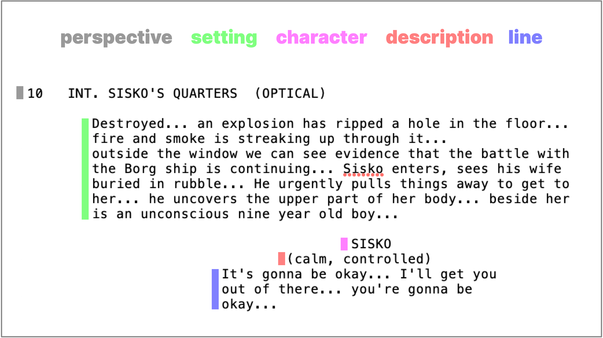

<!-- README.md is generated from README.Rmd. Please edit that file -->

# startrek 

<!-- badges: start -->

[](https://travis-ci.org/tyluRp/startrek)
[](https://ci.appveyor.com/project/tyluRp/startrek)
<!-- badges: end -->

The goal of startrek is to access Star Trek transcripts in a
[`data.frame`](https://stat.ethz.ch/R-manual/R-devel/library/base/html/data.frame.html)
for easy analysis. All transcripts have been parsed from text files to a
[tidy data](http://vita.had.co.nz/papers/tidy-data.html) format.

## Installation

Keep in mind that this is a data package which stores the data locally.
There aren’t any functions which scrape data from a reliable source. As
of now, the size of this package is ~41.68 MB.

If the size isn’t a concern, you can install the development version
from GitHub:

``` r
devtools::install_github("tylurp/startrek")
```

Or, download the data to disk from the data folder in this repository.

## Example

To access an episode transcript from The Next Generation series, see the
`tng` list:

``` r
library(startrek)
library(tibble)
library(dplyr)

tng$the_inner_light
#> # A tibble: 410 x 5
#>    perspective     setting            character description line           
#>    <chr>           <chr>              <chr>     <chr>       <chr>          
#>  1 3 EXT. SPACE -… at warp.           PICARD (… <NA>        Captain's log,…
#>  2 4 INT. BRIDGE   PICARD, RIKER, DA… PICARD    <NA>        The last time …
#>  3 4 INT. BRIDGE   PICARD, RIKER, DA… GEORDI    <NA>        Nine hours... ?
#>  4 4 INT. BRIDGE   PICARD, RIKER, DA… PICARD    <NA>        "The entire \"…
#>  5 4 INT. BRIDGE   PICARD, RIKER, DA… RIKER     <NA>        That's a littl…
#>  6 4 INT. BRIDGE   PICARD, RIKER, DA… PICARD    <NA>        And for me... …
#>  7 4 CONTINUED:    PICARD, RIKER, DA… WORF      <NA>        Sir, sensors d…
#>  8 4 CONTINUED:    PICARD, RIKER, DA… PICARD    <NA>        On screen.     
#>  9 5 ANGLE - VIEW… An alien object o… PICARD    <NA>        Magnify.       
#> 10 5 ANGLE - VIEW… The object spring… PICARD    <NA>        Mister Data?   
#> # … with 400 more rows
```

The Deep Space Nine series is also available:

``` r
ds9$chimera
#> # A tibble: 415 x 5
#>    perspective  setting             character description   line           
#>    <chr>        <chr>               <chr>     <chr>         <chr>          
#>  1 2 INT. RUNA… ODO is in the cock… O'BRIEN   (moving to t… How long was I…
#>  2 2 INT. RUNA… ODO is in the cock… ODO       <NA>          Almost two hou…
#>  3 2 INT. RUNA… O'Brien's surprise… O'BRIEN   (noticing)    You dropped ou…
#>  4 2 INT. RUNA… O'Brien's surprise… ODO       (nods)        We entered the…
#>  5 2 INT. RUNA… O'Brien's surprise… O'BRIEN   (taking a se… What's that?   
#>  6 2 INT. RUNA… O'Brien's surprise… ODO       <NA>          The shopkeeper…
#>  7 2 INT. RUNA… O'Brien's surprise… O'BRIEN   <NA>          I didn't know …
#>  8 2 CONTINUED: O'Brien's surprise… ODO       <NA>          It's a present…
#>  9 2 CONTINUED: O'Brien's features… ODO       (misundersta… You don't thin…
#> 10 2 CONTINUED: O'Brien's features… O'BRIEN   <NA>          I'm sure she w…
#> # … with 405 more rows
```

The columns have been arranged in a specific order to read from left to
right or when using `glimpse()`, top to bottom. For example:

``` r
ds9$chimera %>% 
  .[5, ] %>% 
  glimpse()
#> Observations: 1
#> Variables: 5
#> $ perspective <chr> "2 INT. RUNABOUT"
#> $ setting     <chr> "O'Brien's surprised to hear he was asleep that long…
#> $ character   <chr> "O'BRIEN"
#> $ description <chr> "(taking a seat)"
#> $ line        <chr> "What's that?"
```

The raw text files were parsed using the scripts found in the data-raw
folder of this repository. Below is a visual explanation:

``` r
ds9$emissary %>% 
  .[26, ] %>% 
  glimpse()
#> Observations: 1
#> Variables: 5
#> $ perspective <chr> "10 INT. SISKO'S QUARTERS (OPTICAL)"
#> $ setting     <chr> "Destroyed... an explosion has ripped a hole in the …
#> $ character   <chr> "SISKO"
#> $ description <chr> "(calm, controlled)"
#> $ line        <chr> "It's gonna be okay... I'll get you  out of there...…
```


